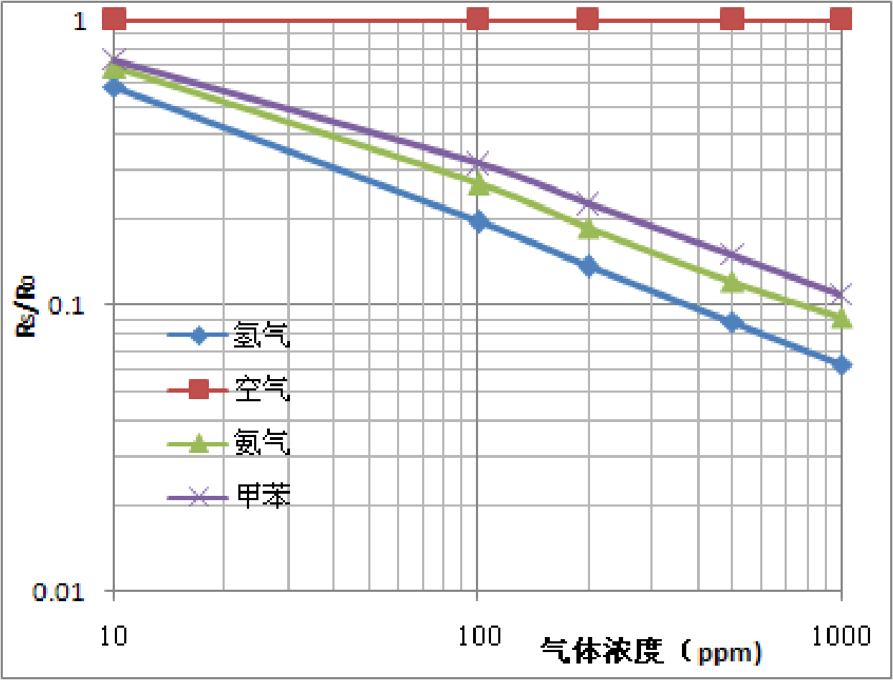
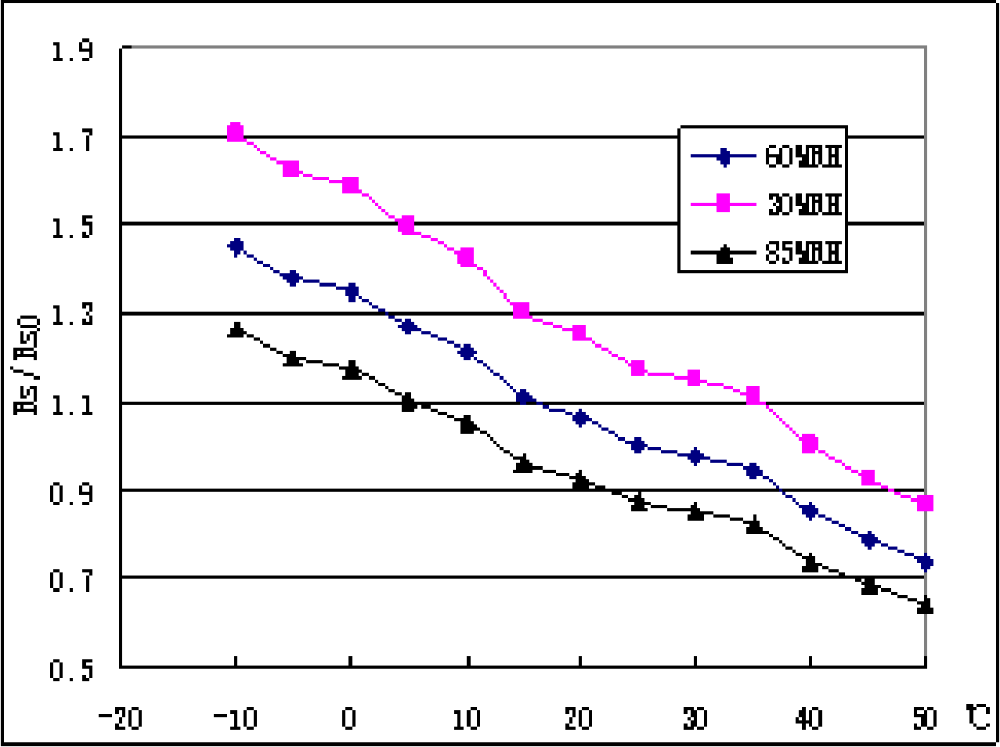
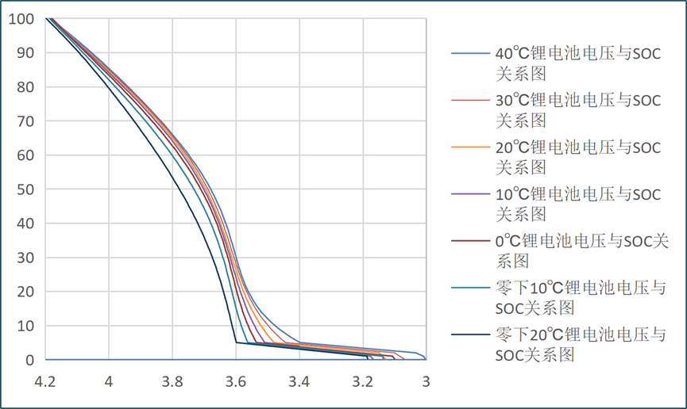

# 节点用到的传感器

Radioactive-jkl<br>
2023/10/7<br>

[](https://github.com/Radioactive-jkl/MultiSensorNode)


#### 目录

- [节点用到的传感器](#节点用到的传感器)
			- [目录](#目录)
	- [DHT22温湿度传感器](#dht22温湿度传感器)
		- [工作原理](#工作原理)
		- [参数与特性](#参数与特性)
		- [使用方法](#使用方法)
	- [MQ2空气质量传感器](#mq2空气质量传感器)
		- [工作原理](#工作原理-1)
		- [参数与特性](#参数与特性-1)
		- [使用方法](#使用方法-1)
	- [GY-30光照强度传感器](#gy-30光照强度传感器)
		- [工作原理](#工作原理-2)
		- [参数与特性](#参数与特性-2)
		- [使用方法](#使用方法-2)
	- [电池电量传感器](#电池电量传感器)
		- [工作原理](#工作原理-3)
		- [参数与特性](#参数与特性-3)
		- [使用方法](#使用方法-3)
	- [总结](#总结)


## DHT22温湿度传感器
&#160; &#160; &#160; &#160;DHT22是一种数字温湿度传感器，上面集成的传感器模块为AM2302。~~太集成了反而不好搞清除工作原理😭~~它使用专门的传感器元件来测量环境的温度和湿度，并将其转换为数字信号输出。

### 工作原理
&#160; &#160; &#160; &#160;以下是DHT22传感器工作的基本步骤：
1. 温度测量：温度感测器是基于热敏电阻原理工作的。该电阻与一个恒定电流源连接，形成一个电压分压电路。通过测量分压电路的电压值，可以确定当前的温度。

2. 湿度测量：湿度感测器是基于湿度对电容的影响原理工作的。它包含一个电容元件和一个集成的湿度传感器。当空气中的湿度发生变化时，介电常数变化改变电容值。

3. 信号处理：传感器中的微控制器单元采集模拟信号进行数字转换，并使用内部算法将其转换为可读的数字温度和湿度值。通过单线串行总线输出给外部设备。

### 参数与特性
<table border="2" >
	<tr>
		<th colspan="2" >基本信息</th>
		<th colspan="2" >温度参数</th>
        <th colspan="2" >湿度参数</th>
	</tr>
	<tr>
		<td>产品型号</td>
		<td>DHT22</td>
        <td>测量范围</td>
        <td>-40~80℃</td>
        <td>测量范围</td>
        <td>0%~99.9%RH</td>
	</tr>
	<tr>
		<td>工作电压</td>
		<td>DC 3.3~5V</td>
        <td>测量精度</td>
		<td>±0.5℃</td>
        <td>测量精度</td>
		<td>±2%</td>
	</tr>
	<tr>
		<td>分辨率</td>
		<td>16位</td>
        <td>最大误差</td>
        <td>±1℃</td>
        <td>最大误差</td>
        <td>±2%</td>
	</tr>
	<tr>
	    <td>采样周期</td>
		<td>2s</td>
        <td>响应时间</td>
		<td>≤20s</td>
        <td>响应时间</td>
		<td>≤5s</td>
	</tr>
</table>

### 使用方法
&#160; &#160; &#160; &#160;本身传出来就是数字信号，所以比较简单。和校准过的温湿度计比对，数值与线性变化大致相同，比较准。代码就Arduino上**DHT sensor library**库来说：

```C++
#include <DHT.h>
// 定义
#define DHTPIN 18
#define DHTTYPE DHT22
DHT dht(DHTPIN, DHTTYPE);

// 一句话就读出值了
temp.temperature = dht.readTemperature();
temp.humidity = dht.readHumidity();
```

## MQ2空气质量传感器
&#160; &#160; &#160; &#160;应该是模块叫MQ-2，上面的传感器叫MQ135。该传感器可用于家庭和工厂的气体泄漏监测装置，适宜于液化气、苯、烷、酒精、氢气、烟雾等的探测。故MQ-2可以准确来说是一个多种气体探测器。

### 工作原理
&#160; &#160; &#160; &#160;MQ-2型烟雾传感器属于二氧化锡半导体气敏材料，属于表面离子式N型半导体。处于200~300摄氏度时，二氧化锡吸附空气中的氧，形成氧的负离子吸附，使半导体中的电子密度减少，从而使其电阻值增加。当与烟雾接触时，如果晶粒间界处的势垒收到烟雾的调至而变化，就会引起表面导电率的变化。利用这一点就可以获得这种烟雾存在的信息，烟雾的浓度越大，导电率越大，输出电阻越低，则输出的模拟信号就越大。加热器还有将附着在敏感元件表面上的尘埃、油雾等烧掉，加速气体的吸附，提高其灵敏度和响应速度的作用。

### 参数与特性
<table border="2" >
	<tr>
		<th colspan="2" >基本信息</th>
		<th colspan="2" >电路参数</th>
        <th colspan="2" >测量参数</th>
	</tr>
	<tr>
		<td>产品型号</td>
		<td>MQ-135</td>
        <td>回路电压 Vc</td>
        <td>≤24V DC</td>
        <td>测量范围</td>
        <td>10~1000ppm</td>
	</tr>
	<tr>
		<td>预热时间</td>
		<td>≥1min</td>
        <td>加热电压 VH</td>
		<td>5±0.1V A/DC</td>
        <td>灵敏度</td>
		<td>≥5ppm</td>
	</tr>
</table>

&#160; &#160; &#160; &#160;这个传感器本身就是混合物测量，对于每一种物质的测量都有不同的范围、灵敏度等，所以这些参数也就大致看个数，准确测量不能使用此传感器。

|灵敏度特性曲线|温湿度特性曲线|
|-------------|------------|
|||

&#160; &#160; &#160; &#160;阻值R与空气中被测气体的浓度C的计算关系式：
$$
log R = mlog C + n
$$
>常数n：与气体检测灵敏度有关，除了随传感器材料和气体种类不同而变化外，还会由于测量温度和激活剂的不同而发生大幅度的变化。<br>
>常数m：表示随气体浓度而变数的传感器的灵敏度（也称作为气体分离率）。对于可燃性气体来说，m的值多数介于1/2至1/3之间。<br>

&#160; &#160; &#160; &#160;整理上述公式可得指数关系，而测量电路中包含加热电路，故通过测量所有参与量并求解理论模型的方法可能精度不如数据拟合。<br>
&#160; &#160; &#160; &#160;对单一一种被测分子，假设查数据手册得其测量范围为$(a_{0},a_{n})$，在干洁空气中半导体阻值$R_0$,对范围内的$a_{i}$测量计算或查表得到对应半导体阻值之比$R_s/R_0=b_{i}$，可以用最小二乘法进行指数拟合得到$y(x)=cx^d$的参数$c$、$d$，那么就可依据具体电路原理得出ppm数值计算公式。

### 使用方法
&#160; &#160; &#160; &#160;对于我的模块，代码如下：
```c++
// 定义
#define D0 33
#define A0 32
static float R0;

// 计算
// calibrate
if(millis() < 60000)//预热一分钟
{
	float Vrl = 3.3f * analogRead(A0) / 4096.f;
	float RS = (3.3f - Vrl) / Vrl * 5.00;
	R0 = RS / pow(20 / 613.9f, 1 / -2.074f); 
}
// calculate
Vrl = 3.3f * analogRead(A0) / 4096.f;
RS = (3.3 - Vrl) / Vrl * 5.00;
float ppm = 613.9 * pow(RS/R0, -2.074);
```


## GY-30光照强度传感器
&#160; &#160; &#160; &#160;GY-30算模块名字吧，上面的芯片是BH1750FVI。BH1750是一种数字式光照强度传感器，使用一对光敏二极管来测量环境中的光照强度，并将结果以数字形式输出。

### 工作原理
&#160; &#160; &#160; &#160;GY-30模块（集成了BH1750FVI芯片）的工作原理如下：（这段GPT说的不保真😅，而且查资料有的说光敏二极管，有的说光敏电阻）
1. 光敏二极管阵列：GY-30模块中的BH1750FVI芯片包含一个光敏二极管阵列，它由多个光敏二极管组成。这些光敏二极管感应环境中的光，并产生相应的电流。

2. 控制电路：BH1750FVI芯片内部有电路控制光敏二极管阵列的工作模式和数据处理。光敏二极管产生的电流被控制电路中的ADC转换为数字信号。输出数值单位为勒克斯（lx）。

3. 数字通信：BH1750FVI芯片通过I2C总线与主控设备进行通信，可以进行模式配置。

### 参数与特性
<table border="2" >
	<tr>
		<th colspan="2" >基本参数</th>
		<th colspan="2" >测量参数</th>
	</tr>
	<tr>
		<td>模块名称</td>
		<td>GY-30</td>
		<td>测量范围</td>
		<td>0~65535lx</td>
	</tr>
	<tr>
	   <td>供电电压</td>
		<td>DC 3~5V</td>
		<td>灵敏度</td>
		<td>1lx</td>
	</tr>
</table>

### 使用方法
&#160; &#160; &#160; &#160; 传出来就是数字信号，但手头没有定量校准工具。代码就Arduino上**BH1750**库来说：

```C++
#include <BH1750.h>
// 定义
#define sda_gy30  21
#define scl_gy30  22
BH1750 lightMeter;

// 阻塞读值
while (!lightMeter.measurementReady(true)) 
{
	yield();
}
lightMeter.configure(BH1750::ONE_TIME_HIGH_RES_MODE);
temp.illumination = lightMeter.readLightLevel();
```


## 电池电量传感器
&#160; &#160; &#160; &#160;对于本系统中的节点来说，就是直接用ADC测电压来映射电量百分比。

### 工作原理
&#160; &#160; &#160; &#160;用ESP32的ADC测量电阻分压1S锂电池的电压值，对照常温电压与电量百分比关系粗略估算电池电量。

### 参数与特性


### 使用方法
&#160; &#160; &#160; &#160;假设12位ADC通道获取的值$Ai$，在ESP32中求得电压$V_{ADC}=3.3*Ai/4095$，电阻分压后的比例关系为$R/R_L=V_{ADC}/V_{battery}$，利用上图关系打表可得如下代码：
```c++
// 定义
#define ANALOG_PIN 34
int percentage = 100;
double capacity[101]={
          4.179,4.169,4.157,4.146,4.134,4.123,4.111,4.099,4.088,4.076,
          4.063,4.051,4.040,4.028,4.017,4.005,3.994,3.982,3.971,3.960,
          3.949,3.938,3.927,3.916,3.906,3.895,3.885,3.875,3.865,3.855,
          3.845,3.836,3.827,3.818,3.809,3.800,3.792,3.784,3.775,3.768,
          3.760,3.753,3.745,3.738,3.732,3.725,3.719,3.713,3.707,3.701,
          3.695,3.690,3.685,3.679,3.675,3.670,3.665,3.661,3.657,3.652,
          3.648,3.645,3.641,3.637,3.633,3.630,3.626,3.623,3.619,3.616,
          3.613,3.609,3.606,3.602,3.599,3.595,3.592,3.588,3.584,3.580,
          3.576,3.571,3.567,3.562,3.557,3.552,3.546,3.540,3.534,3.528,
          3.521,3.513,3.506,3.498,3.489,3.480,3.370,3.260,3.149,3.138,
          3.126};
float val=0;
// 计算
for (int i = 0; i < 10; i++)
{
	val+=analogRead(ANALOG_PIN);
	delay(5);
}
val /= 10;
float voltage = (((float)val)/4095)*3.3*3.0;
for (int i = 0; i < 100; i++)
{
	if ((voltage>=capacity[i+1]) || (voltage<=capacity[i]))
	{
		percentage = 100 - i;
		break;
	}
}
temp.battery = percentage;
```

## 总结
&#160; &#160; &#160; &#160;看着传感器商家资料和网上一些资料总结的，错误肯定很多。目前测试可用，但是想更精确地测量肯定很多地方要深入研究。