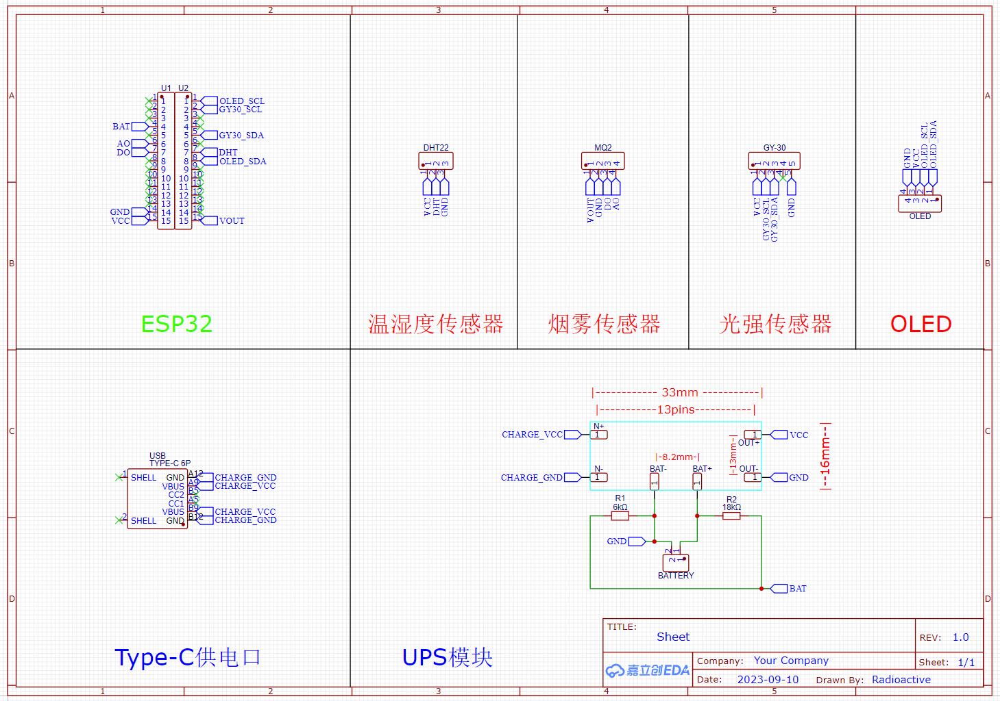
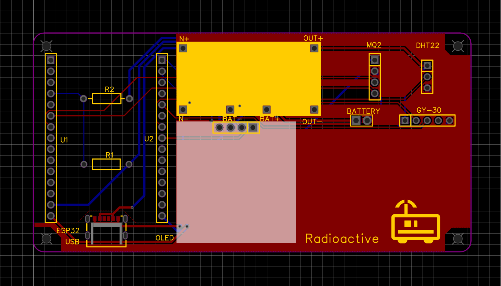
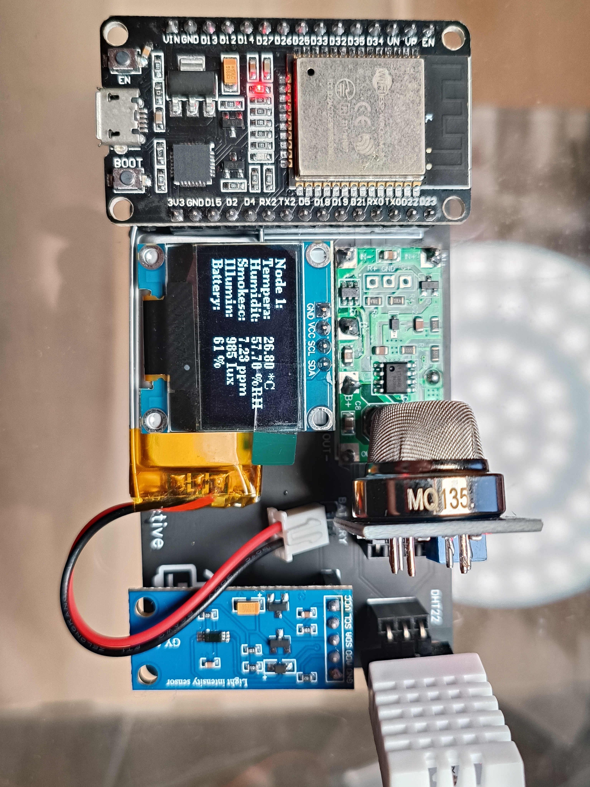

# 自制节点

Radioactive-jkl 
2023/10/20 

## 电路原理图
&#160; &#160; &#160; &#160;我这水平就不把源文件放出来丢人了，本身电路就不复杂，图省事没画封装，直接立创EDA拖几个封装连连线而已。

## PCB设计
&#160; &#160; &#160; &#160;没什么好说的，又没高频信号，线都连好应该就能用。信号线细点加个泪滴，电源线粗点，铺铜别盖ESP32天线就行。

## 实物
&#160; &#160; &#160; &#160;就是拿电烙铁锡丝焊Type-C很烦。
