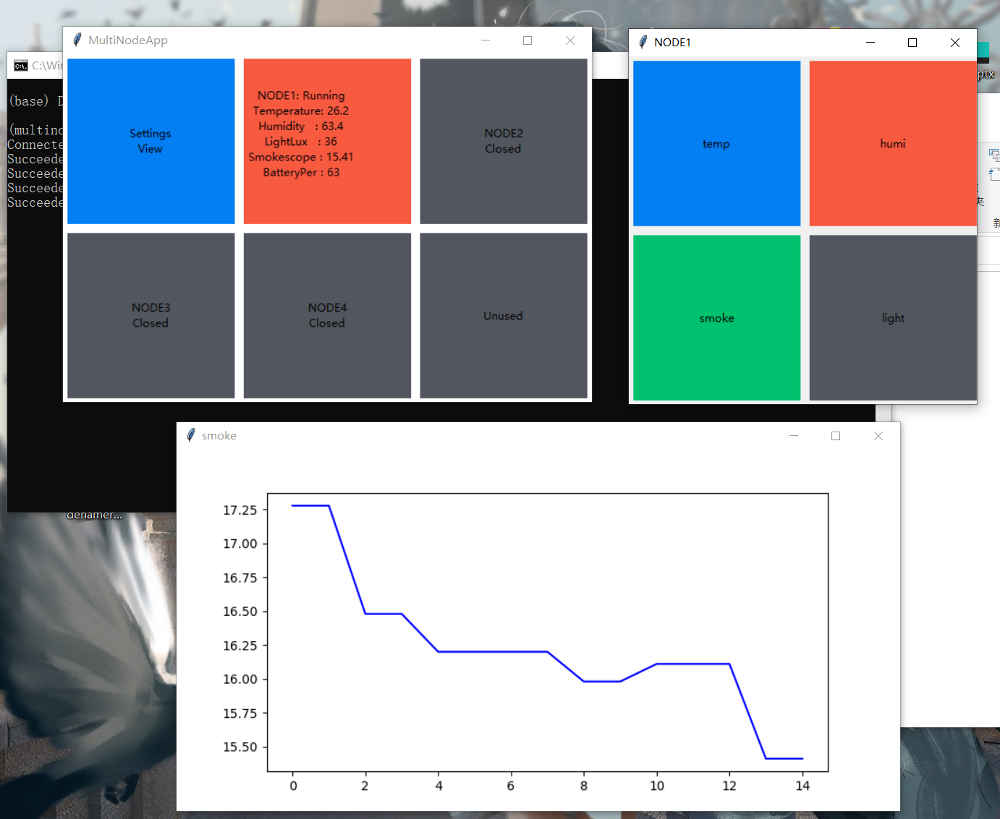
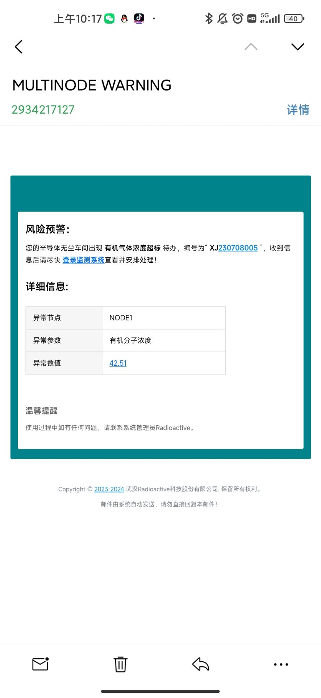

# 桌面端程序

Radioactive-jkl 
2023/10/20 

## 介绍
&#160; &#160; &#160; &#160;这一部分就是偷懒直接拿之前[<u>龙芯的代码</u>](https://github.com/Radioactive-jkl/LongXin_socchina/tree/main/LongXinPI)改的。其实要好好做的话还是应该C++写Qt，这样还能用同一套代码把手机程序搞定了。没有做美化，就只有功能可行性。 
 
&#160; &#160; &#160; &#160;还有超过阈值报警🤣。 

